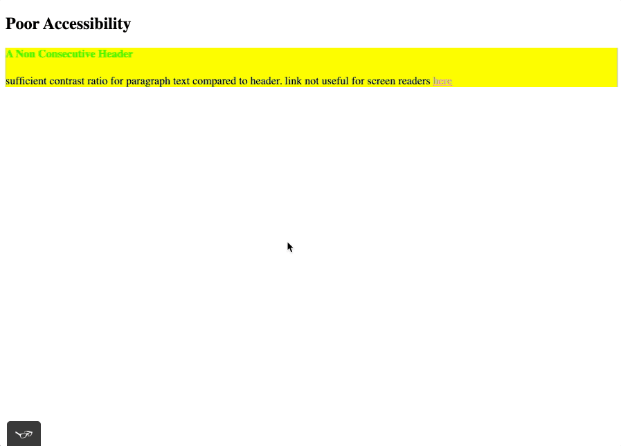

## tota11y webpack react typescript example
a modern example of how to introdude accessibility (a11y) tools into a react application for testing and compliance standards.

this repo is a POC on how to use tota11y, a more applicable solution would be to have seperate environment flags or `webpack.config` files based on needs. Such as development, QA, staging, or a11y.


---
Table of contents:
* [problem](#problem)
* [why](#why)
* [running the example](#running-the-example)
* [solution](#solution)
* [future](#future)
---

### [problem](#problem)
A11y is often a requirement for many web applications and services. Teams with manual testers or compliance analysts often struggle to use the built-in tooling that browsers come with due to advance knowledge of their usage.

When deploying new builds of your product on different environments (development, qa, staging, production), engineers may neglect ways to increase the productivity of non-engineering workers.

This may cause issues when trying to ensure that your product is a11y compliant in a timely and efficient manner.

---

### [why](#why)
Tooling for a11y has gotten increasingly better over the last 5 years. Libraries like [axe-core](https://github.com/dequelabs/axe-core) have introduced a variety of solutions for many testing libraries, suchas [jest-axe](https://github.com/nickcolley/jest-axe) and [cypress-axe](https://github.com/avanslaars/cypress-axe). Even browsers, like [chrome](https://developers.google.com/web/tools/chrome-devtools/accessibility/reference) and [safari](https://developer.apple.com/safari/features/#accessibility), now have better capabilities compared to a decade ago.

[tota11y](https://github.com/Khan/tota11y) is a tool that we can inject into our app, as part of our build process, to give manual testers additional capabilities with verifying or triaging a11y issues.

**Note:** while tota11y does help find common issues, this is not a gurantee that you will cover all the needs of your build for your users. You will still need to test your interface with [real assistive technologies that your users use](https://www.gov.uk/service-manual/technology/testing-with-assistive-technologies#when-to-test), also see [WebAIM's survey findings](https://webaim.org/projects/screenreadersurvey7/#primary). You will also need to include people with disabilities in your user research groups.

---

### [running the example](#running-the-example)
Clone the repo, once finish cloning run the following command to install the project dependencies:
```
npm i
```

After installing the dependencies, run the following command to start the webpack server with [tota11y](https://github.com/Khan/tota11y) injected:
```
npm start
```

[tota11y](https://github.com/Khan/tota11y) usage in our webpack server:



---

### [solution](#solution)
#### ([tell me what to do cause I don't know how](https://www.youtube.com/watch?v=kBSdNy7oI4g#t=3m55s))
**prerequisites**

This example assumes you are using at least [webpack](https://github.com/webpack/webpack) v4.

At the time of this tutorial, this project is currently using [webpack](https://github.com/webpack/webpack) v4.41.5.

**usage**

In order to inject [tota11y](https://github.com/Khan/tota11y) into our build we need to install the following webpack plugins:
* [html-webpack-plugin](https://github.com/jantimon/html-webpack-plugin)
* [add-asset-html-webpack-plugin](https://github.com/SimenB/add-asset-html-webpack-plugin)

In our `webpack.config.js` the order of our plugins matter, `add-asset-html-webpack-plugin` needs to be listed after the `html-webpack-plugin` as such:
```js
const { CleanWebpackPlugin } = require('clean-webpack-plugin');
const HtmlWebpackPlugin = require('html-webpack-plugin');
const AddAssetHtmlPlugin = require('add-asset-html-webpack-plugin');
const ManifestPlugin = require('webpack-manifest-plugin');
const path = require('path');

module.exports = [
  {
// skipping to the plugin section
    plugins: [
      new CleanWebpackPlugin(),
      new ManifestPlugin({ fileName: '../manifest.json' }),
      // AddAssetHtmlPlugin needs to follow the HtmlWebpackPlugin in order to properly inject scripts
      new HtmlWebpackPlugin({
        template: path.resolve(__dirname, 'public/index.html'),
        filename: '../index.html'
      }),
      new AddAssetHtmlPlugin({
        filepath: require.resolve('./node_modules/@khanacademy/tota11y/dist/tota11y.min.js')
      }),
    ],
    stats: 'minimal',
  },
];
```

Now when we start our server and build our assets the following script tag is added to our `public/index.html` file:
```html
<!-- ignoring head tags -->
<body>
  <!-- showing how script tags are generated -->
  <script type="text/javascript" src="/dist/client/tota11y.min.js"></script>
  <script type="text/javascript" src="/dist/client/main.js"></script>
</body>
```

---

### [future](#future)
may include future examples of how to inject [tota11y](https://github.com/Khan/tota11y) into other bundlers like [parcel](https://github.com/parcel-bundler/parcel) or [browserify](https://github.com/browserify/browserify). will be linked to in the future between repos READMEs.

may include an example of how to use with [create-react-app](https://github.com/facebook/create-react-app).
